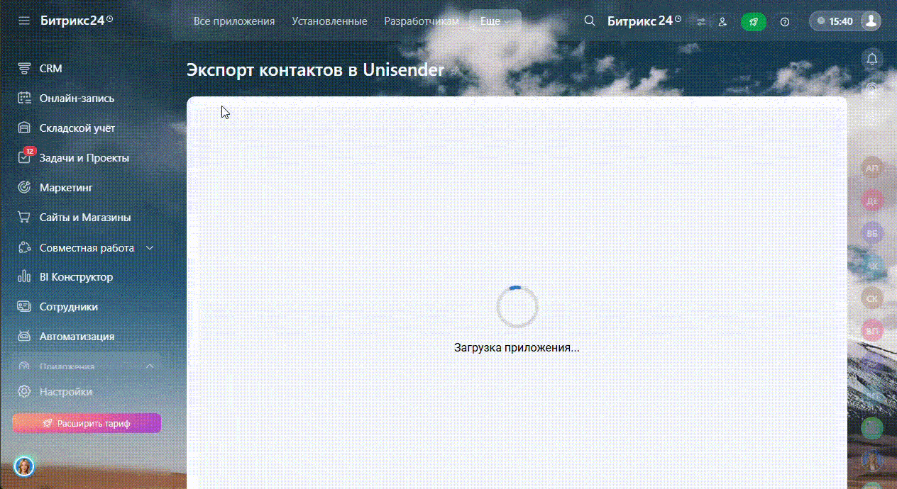
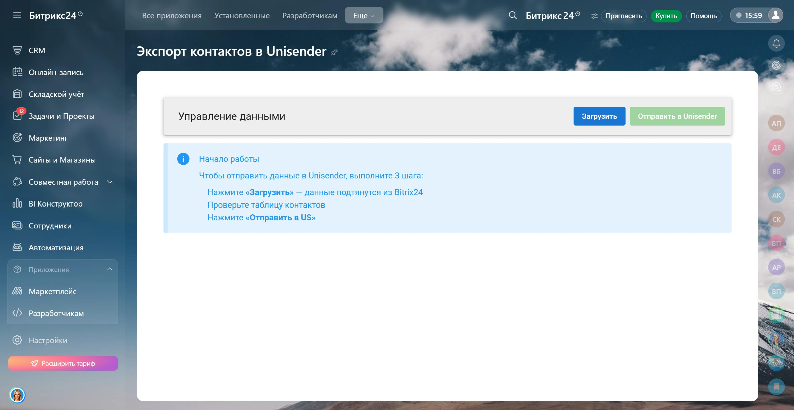
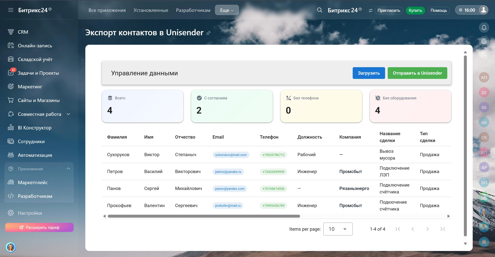
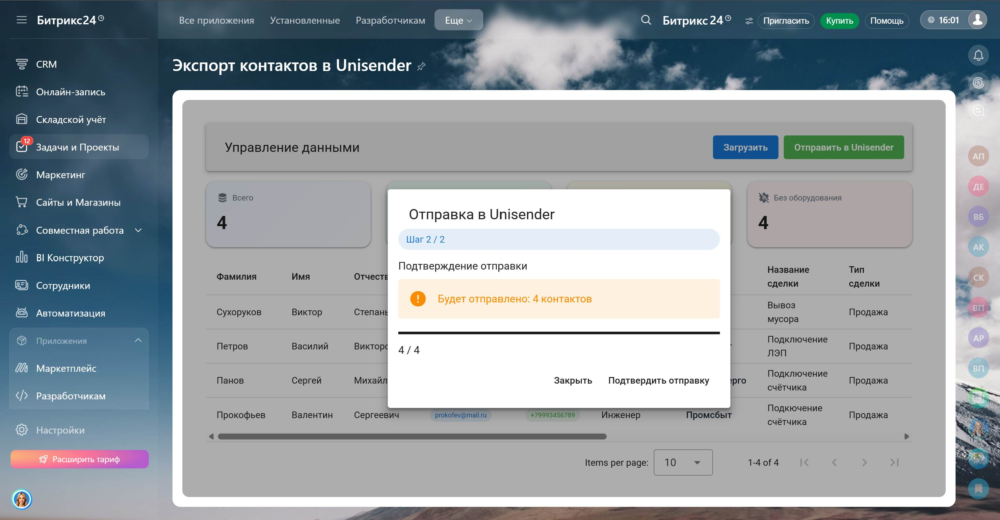
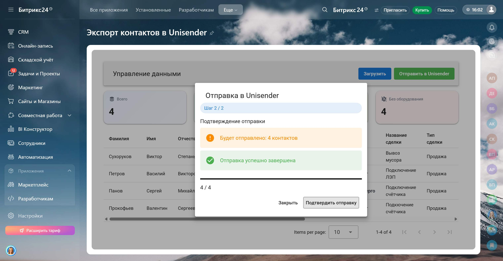

<h1 align="center">Автоматизация формирования клиентской базы для email-рассылок 📬</h1>

ETL-инструмент для выгрузки контактов из CRM, обработки данных и отправки в сервис email-рассылок

<b>🔄 Автоматизация выгрузки • 🧹 Очистка данных • 📤 Контролируемая отправка</b>

<h2>🎥 Демонстрация</h2>

 
<em>Процесс загрузки, проверки и отправки контактов</em>

 

<table width="100%">
<tr>
<td align="center">

 
  
<em>Начальный экран</em>
</td>

<td align="center">

  
 

<em>Вывод данных</em>
</td>
</tr>

<tr>
<td align="center">
  

 

<em>Проверка данных перед отправкой</em>
</td>

<td align="center">
  

  
 

<em>Успешная отправка в Unisender</em>
</td>
</tr>
</table>

<h2>🧩 Контекст задачи</h2>

Клиент использовал Bitrix24 как основную CRM, а Unisender — для email-рассылок.
Возникла задача автоматизировать передачу контактов между системами с учетом бизнес-логики.

Важно было не просто выгружать данные, а:

<ul>
<li>учитывать только релевантные сделки</li>
<li>фильтровать некорректные контакты</li>
<li>исключить риск массовых ошибок при отправке</li>
</ul>

<h2>💡 Что было реализовано</h2>

<ul>
<li>Массовая загрузка сделок, контактов и компаний из Bitrix24</li>
<li>Фильтрация контактов без email и без привязки к сделке</li>
<li>Поддержка кастомных полей (город, оборудование, выставка и др.)</li>

<li><b>Двухэтапная отправка данных (Dry-run + реальная отправка)</b></li>

<li>Dry-run режим для предварительной проверки данных</li>
<li>Отправка данных в Unisender через API</li>
<li>Отображение прогресса отправки в реальном времени</li>
<li>Подтверждение успешной отправки</li>
</ul>

<h2>⚙️ Логика работы</h2>

<ul>
<li>Загружаются сделки по выбранным направлениям</li>
<li>Определяются связанные контакты и компании</li>
<li>Фильтруются контакты без email</li>
<li>Данные очищаются от пустых значений</li>
<li>Формируется база контактов для Unisender</li>
<li>Происходит двухэтапная проверка данных перед отправкой</li>
<li>Клиентская база отправляется в Unisender</li>
</ul>

<h3>📤 Двухэтапная отправка</h3>

<ul>
<li><b>Шаг 1 — Dry-run (проверка данных)</b></li>
<li><b>Шаг 2 — Реальная отправка в Unisender</b></li>
</ul>

Перед реальной отправкой пользователь сначала запускает режим проверки (dry-run).
На этом этапе система имитирует отправку и показывает:

<ul>
<li>общее количество контактов</li>
<li>прогресс обработки</li>
<li>готовность данных к отправке</li>
</ul>

Это позволяет убедиться, что:

<ul>
<li>данные корректно собраны</li>
<li>нет пустых или некорректных значений</li>
<li>логика фильтрации работает правильно</li>
</ul>

Только после этого пользователь вручную подтверждает реальную отправку.

<b>Зачем это нужно:</b>

<ul>
<li>❌ исключает риск случайной отправки некорректных данных</li>
<li>📉 снижает вероятность ошибок при массовой загрузке</li>
<li>🔍 дает прозрачность — пользователь видит, что именно будет отправлено</li>
<li>🛡 защищает базу Unisender от "засорения"</li>
</ul>

<h2>📊 Особенности бизнес-логики</h2>

<table>
<tr>
<th>Правило</th>
<th>Описание</th>
</tr>

<tr>
<td>Фильтр email</td>
<td>Контакт не отправляется без email</td>
</tr>

<tr>
<td>Связь со сделкой</td>
<td>Контакт должен быть привязан к сделке</td>
</tr>

<tr>
<td>Направления</td>
<td>Учитываются только выбранные воронки</td>
</tr>

<tr>
<td>Agreement</td>
<td>Рассчитывается по стадии сделки и воронке</td>
</tr>
</table>

 

<ul>
<li>🟢 Согласие = true → контакт можно использовать в рассылке</li>
<li>🔴 Согласие = false → контакт остается, но помечен</li>
<li>📤 Все данные отправляются в единый список Unisender</li>
</ul>

<h2>🛠 Технологический стек</h2>

<table width="100%" cellpadding="10">
<tr>
<td align="center">
 
<b>Vue 3</b>
</td>

<td align="center">
 
<b>Vuetify</b>
</td>

<td align="center">
 
<b>TypeScript</b>
</td>

<td align="center">
 
<b>Vite</b>
</td>

<td align="center">
 
<b>Fetch API</b>
</td>

<td align="center">
 
<b>Bitrix24 REST API</b>
</td>

<td align="center">
 
<b>Unisender API</b>
</td>
</tr>
</table>

<h2>📩 Контакты</h2>

Telegram: <a href="https://t.me/volodin7ergey">@volodin7ergey</a> 
VK: <a href="https://vk.com/volodin7ergey">vk.com/volodin7ergey</a>

<b>Готов разработать аналогичные решения под Ваши бизнес-процессы 💼</b>

